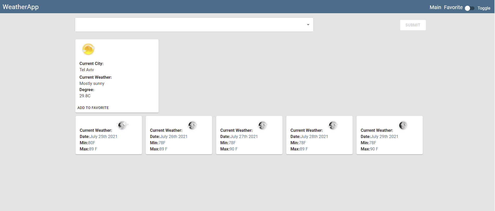

  [](https://shields.io/)
  [](https://shields.io/)
  [](https://shields.io/)
  [](https://shields.io/)
  
  

# Introduction: Weather Dashboard

Create a web application using AccuWeather API.
As a user I want to know the current weather of the day and the 5 days forecast
I build this project to represent my programming skills.
## User Story

```
AS A traveler
I WANT to see the weather outlook for multiple cities
SO THAT I can plan a trip accordingly
```
## Screenshot 




### Prerequisites

Visual Studio Code 

## Built With

- HTML5 
- CSS
- JavaScript
- React
- Redux


## Authors

- Philip Kouchner
- Github link-https://philipk-webdev.github.io/WeatherApp/